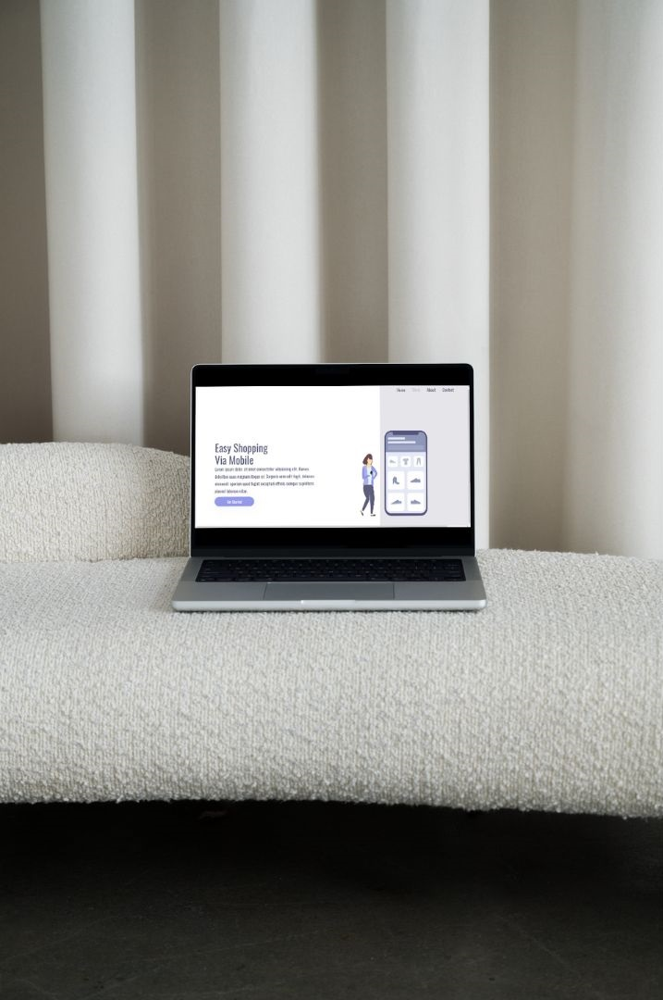
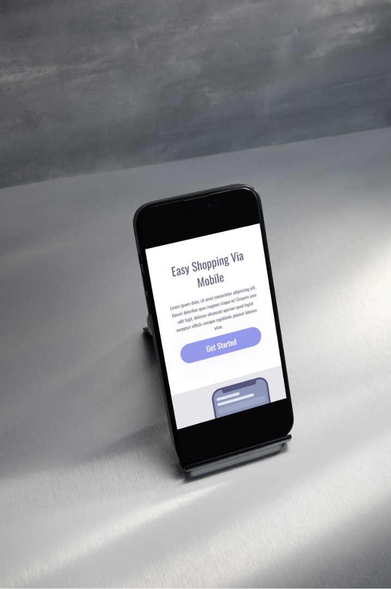
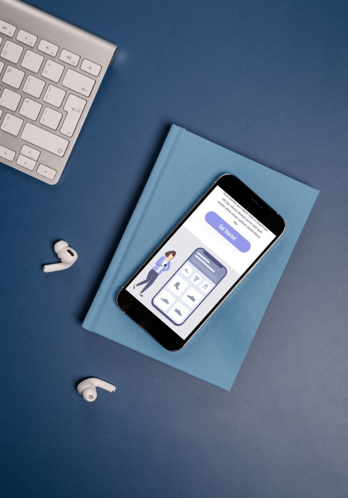

<h1>Project Easyshopping</h1>

"EasyShopping" is a dynamic HTML and CSS project that offers a mobile shopping experience. It shares core elements with "We Care," including responsive design, functional links, buttons, and expertly formatted text. However, it goes a step further by incorporating seamlessly adaptation to various screen resolutions.

## Features

- Responsive design optimized for mobile shopping.
- Functional links and buttons for an intuitive user interface.
- Expertly formatted text to enhance readability.
- Distinct background designs to create a visually appealing shopping experience.

## Technologies Used

- 
- 

## Preview and Link

[Link to Live Demo](https://jhschier.github.io/Project-Shopping-Mobile/)

## About

"EasyShopping" is a project that offers a mobile shopping experience with a focus on user-friendly design and responsive layouts. It builds upon the core elements of "We Care" to create a visually appealing and functional shopping platform.
